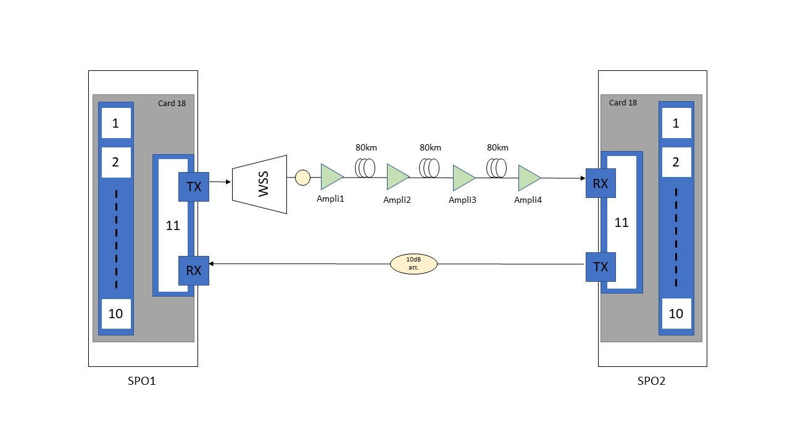

# Optical Failure Dataset

The following datasets were created using the ARNO testbed within the InRete Lab at the TeCIP Institute, Scuola Superiore Sant'Anna.
Using the system presented in A. Sgambelluri et al., ["Reliable and scalable Kafka-based framework for optical network telemetry"](https://www.osapublishing.org/jocn/abstract.cfm?uri=jocn-13-10-E42), we continously collected metrics from the optical testbed in normal condition in which we emulated periodic failures.

## Testbed description 
The testbed is composed of two Ericcson SPO 1400 devices (named *SPO1* and *SPO2*), each equipped with a 100Gb/s Optical Transport Network (OTN) muxponder (installed at the slot 18) with a DWDM optical line (port 11) and 10 tributary ports. Each muxponder is able to collect coherent metrics (i.e., BER and OSNR).
The output of the first SPO (*SPO1*) has been attached to a WSS, which is then attached to multi-span link over a 10dB attenuator. 
The multispan is actually composed of 3 spans, each with a length of 80km (240km total length), which have 4 EDFA amplifiers in the middle. 
Those amplifiers are controlled by the SPO devices: more specifically, the first and second amplifier (*Ampli1* and *Ampli2*) are controlled by the *SPO1*, while the other two (*Ampli3* and *Ampli4*) by the *SPO2*. 
Each amplifier has been configured in constant gain mode, that allows to enter each span with 0dBm of optical power.
The reverse link, from *SPO2* to *SPO1* is in back-to-back configuration, presenting a 10dB attenuator.

## Datasets details
The two dataset are composed with samples that are gathered from both SPO's cards and amplifiers, every 3,5 seconds.

For each SPO, the following metrics are retrieved:
- Optical Signal to Noise Ratio (OSNR)
- Bit Error Rate (BER)

For each amplifier instead, we retrieved:
- Input Power 
- Ouput Power

For this reason, the csv has been structrured with the following fields:
- **Timestamp**: Unix format.
- **Type**: which has two possible values according to which device the metric is referring to:
  - *Infrastructure*, for the amplifiers.
  - *Devices*, for the SPO devices.
- **ID**: which refers to the id used in the testbed picture:
  - *SPO1/18/11* (the identifier of the optical port on the SPO, following the schema SPO_ID/Card_ID/Port_ID);
  - *SPO2/18/11*;
  - *Ampli1*;
  - *Ampli2*;
  - *Ampli3*;
  - *Ampli4*.
- **BER**: only for the SPOs related entries.
- **OSNR**: only for the SPOs related entries.
- **InputPower**: only for the amplifiers related entries.
- **OutputPower**: only for the amplifiers related entries.
- **Failure**: field showing entries acquired while simulating the failure.

In both datasets we used the WSS to provide changes to the attenuation at the *Ampli1*, and so emulating both normal and abnormal conditions in the network. 
The *Failure* field is used as an indicator that shows all the entries that are gathered while the input power of the *Ampli1* is too low due to the WSS configuation. 

### Hard Failure dataset

This 10 hours dataset is divided in three parts:
- 6 hours in normal network condition (real, no changes applied with the WSS);
- 2 hours with variable attenutation in normal condition (emulated with WSS, starts at entry with timestamp *1623416399*);
- 2 hours with periodic (hard) failures (with WSS, starts at *1623423687*).

More precisely, in the second part we used the WSS to randomly change the attenuation every 10 seconds in a range from 0 to 18dB. In the third part, we have the same behaviour with the addition of a 25dB attenuation every 40 seconds, and so putting the network in a failure condition for 10 seconds. After that, the WSS is reconfigured so that the network starts working properly again. 

### Soft Failure dataset

This other dataset has been created over a 8 hours period:
- 4 hours with variable attenutation in normal condition (emulated with WSS);
- 4 hours with periodic (soft) failures (with WSS).

The entry with timestamp *1624471536* delimits the two parts. 

In this case, we tried a different approach with respect to the previous dataset. Instead of applying random changes to the attanuation in a range, we followed a sinusoidal path: every minute the attuation increases or decreases by ~0.5dB, moving from a maximum input power of -19,2dB to a minimum of -21,1dB at the *Ampli1*.
In the second half, we overlapped to this behaviour a 10dB attenuation every 4 minutes, which produces a soft failure event (the BER and the OSNR at the receiver are affected but the network is still working). After that, the WSS is reconfigured so that the network starts working properly again. 

## Publications
Those datasets has been used to provide results for the following pubblications:
- Hard Failure dataset:
	- M. F. Silva, A. Pacini, A. Sgambelluri and L. Valcarenghi, "Learning Long-and Short-Term Temporal Patterns for ML-driven Fault Management in Optical Communication Networks," in IEEE Transactions on Network and Service Management, [doi: 10.1109/TNSM.2022.3146869](https://ieeexplore.ieee.org/abstract/document/9695983).

