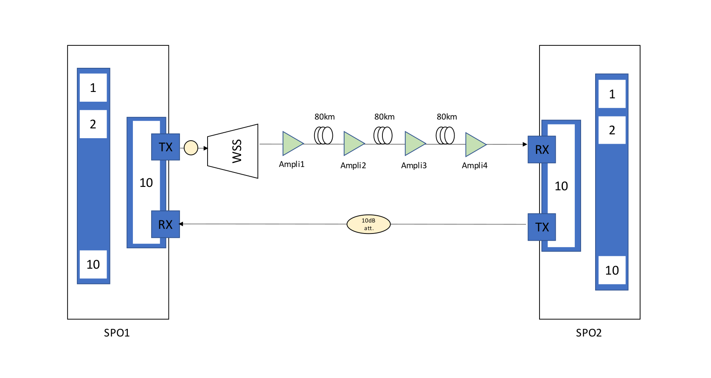

# Optical Failure Dataset

The following dataset has been builted up using the ARNO testbed within the InRete Lab at the TeCIP Institute, Scuola Superiore Sant'Anna.
Using the system presented in A. Sgambelluri et al., ["Reliable and scalable Kafka-based framework for optical network telemetry"](https://www.osapublishing.org/jocn/abstract.cfm?uri=jocn-13-10-E42), we continously collected metrics from the optical testbed in normal condition in which we emulated periodical failures.

## Testbed description 
The testbed is composed of two Ericcson SPO 1400 devices (SPO1 and SPO2), each equipped with a 100Gb/s Optical Transport Network (OTN) muxponder (installed at the slot 18) with a DWDM optical line (port 11) and 10 tributary ports. Each muxponder is able to collect coherent metrics (i.e., BER and OSNR).
The output of the first SPO (SPO1) has been attached to a WSS, which is then attached to multi-span link over a 10dB attenuator. 
The multispan is actually composed of 3 spans, each with a length of 80km (240km total length), which have 4 EDFA amplifiers in the middle. 
Those amplifiers are controlled by the SPO devices: more specifically, the first and second amplifier (Ampli1 and Ampli2) are controlled by the SPO1, while the other two (Ampli3 and Ampli4) by the SPO2. 
Each amplifier has been configured in constant gain mode, that allows to enter each span with 0dBm of optical power.
The reverse link, from SPO2 to SPO1 is in back-to-back configuration, presenting a 10dB attenuator.

